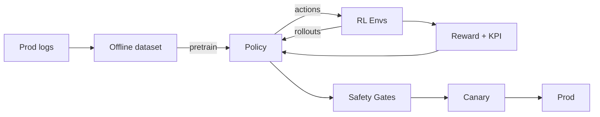

# Dishank Jhaveri
**AI Engineer — Voice Agents, Tool-Calling LLMs, and RL-Tuned Decision Systems**  
📧 [dishankjhaveri@gmail.com](mailto:dishankjhaveri@gmail.com) · 💼 [LinkedIn](https://linkedin.com/in/dishankjhaveri) · 🐙 [GitHub @dishank19](https://github.com/dishank19)

---

## What I Build
💬 **Voice AI agents** that actually do work: answer calls, extract facts, take action  
🧭 **Agentic systems** with reliable tool access (LangGraph + MCP) and guardrails  
☁️ **Production infra** on GCP with clean observability and sane autoscaling

> Ship real agents for real teams—safely, fast, and at scale.

---

## Featured Work

**PatientIntakeVoiceAgent**  
Production-style voice intake with turn-taking, info capture, slot-filling, and warm handoff.
```
Stack: Python · FastAPI · Pipecat · OpenAI · Cartesia TTS · Twilio · Docker
Repo: dishank19/PatientIntakeVoiceAgent
```

**Google_Ads_Agent**  
Agent that researches keywords, adjusts bidding strategies, and manages ad groups autonomously.
```
Stack: Python · FastAPI · GAQL · LangGraph
```

**leadgen-agent**  
Dental lead qualification with clinic lookup, appointment simulation, and automated notifications.
```
Stack: Python · Retell/Voice · Twilio · Livekit
```

**Mistral7B_Finetune**  
Fine-tuned Mistral-7B on SHP dataset for AskHistorians-style long-form responses.
```
Stack: PyTorch · QLoRA · PEFT · HuggingFace Transformers
```

---

## Currently Building
**RL-tuned agents** — Train policies in simulated funnels (dialog, keyword bidding, handoff) to optimize business KPIs instead of proxy metrics  
**Custom environments** — Gymnasium/PettingZoo-style envs + reward models that mix goal attainment, latency budgets, and safety constraints  
**Safety & eval** — Risk critics + rule gates; scenario suites; offline → canary → prod promotion



---

## Skills

```yaml
Core:          Python, TypeScript/JavaScript, SQL, Go, Java, C/C++
Agents:        LangGraph, MCP, tool-calling, RAG
Voice:         LiveKit, Pipecat, Twilio (SIP/PSTN), WebRTC, Cartesia TTS
RL:            Gymnasium, Verifiers, Stable-Baselines3, RLlib
ML/LLM:        OpenAI API, HuggingFace, PyTorch, Transformers, spaCy
Backend:       FastAPI, Node/Express, React, REST APIs
Cloud/Infra:   GCP (Cloud Run, GKE, Logging), Docker, GitHub Actions, AWS
Data:          PostgreSQL, MongoDB, S3/GCS, Pandas, NumPy
```

---

## Experience
**AI Engineer — Neurality AI** · San Francisco  
Shipped production voice agents (scheduling, clinical docs, insurance verification) on GCP; designed LangGraph workflows and MCP tool surfaces; built internal copilots that reduced manual ops.

**ML Research — Graphite.io** · Long-form style transfer (SELF-DISCOVER), large-scale evaluation, classifiers for formality/politeness/humor/simplicity

**ML Engineer — Street Style Store** · ETL, realtime analytics, recommender systems/segmentation, ROI-driven data tooling

**Education:** M.S. Computer Science, UMass Amherst · B.Tech Computer Science, VIT

---

## Design Philosophy
```python
# Voice agent loop with tool access and safety
while call.active():
    text = asr.listen_stream()
    state = dialog.update(text)
    action = planner.decide(state)              # LangGraph node
    if safety.blocks(action): action = planner.fallback(state)
    result = tools.execute(action, via="MCP")   # standardized, authenticated surface
    tts.say(render(result))
```

**Building production agents with RL-driven performance?** Let's chat: https://calendar.app.google/UMEFJTfYpFtCUXBG7
